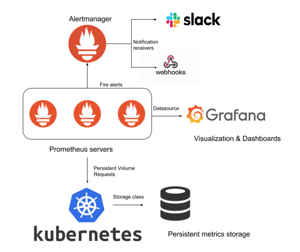

# Hi

# Configuration for 'prod' and 'dev' Stages of the Monitoring-Alerting Solution Based on Prometheus and Grafana.



This setup uses Bash scripts to create and push secrets into AWS Secrets Manager, and to pull them back into the Kubernetes environment. It also employs Kubernetes manifest files to create resources following Kubernetes best practices.


Monitoring is crucial for maintaining the health, performance, and stability of AWS Elastic Kubernetes Service (EKS) cluster. 
The Prometheus-Grafana monitoring stack is a popular choice for monitoring EKS clusters as it provides powerful, flexible, and scalable monitoring capabilities.

## Architecture:
The architecture of the Prometheus-Grafana monitoring-alerting stack for an AWS EKS cluster typically consists of the following components:

### Kube-State-Metrics:

- generates metrics by aggregating information from the Kubernetes API server about the state of objects (such as pods, deployments, replicasets, etc.) in the cluster. It exposes these metrics in a format that Prometheus can scrape.

### Node Exporter:

- collects metrics from the underlying OS and hardware of each node in the Kubernetes cluster. It provides essential system-level metrics like CPU usage, memory usage, disk space, network statistics, etc. These metrics are scraped by Prometheus to monitor the health and performance of individual nodes.

### Kubernetes API Server:

- is the central control plane component that exposes by default the Kubernetes API, allowing users and other components to interact with the Kubernetes cluster. You do not need to deploy this component, it is already exists exposing metrics for scraping by Prometheus.

### Prometheus:

- is an open-source monitoring and alerting system that gathers metrics from different targets: Kube-State-Metrics, Node Exporter and Kubernetes API Server. It stores the collected data in the time-series database and supports a flexible querying language, PromQL, to analyze and retrieve metrics.
The Prometheus server runs as a pod in the Kubernetes cluster. It scrapes (pull) and stores metrics from various targets at regular intervals, based on predefined scraping configurations.

### Grafana:

- is an open-source data visualization tool that provides features to create dashboards and graphs based on data from various data sources, including Prometheus.
The Grafana server runs as a pod in the Kubernetes cluster and connects to the Prometheus server to query and retrieve metrics. It provides a web interface through which users can create and view dashboards, set up alerts, and interact with the data.

### Persistent Storage:

- Prometheus require persistent storage to store their data and configurations. AWS EBS (Elastic Block Store) volumes or other AWS storage services can be used for this purpose.

### Secrets:

- Since Grafana exposed to the Internet it requires secret configuration. It is achieved by creating AWS secrets and injecting it in Kubernetes.


## Monitoring Flow:

Prometheus scrapes metrics from various targets (pods, nodes, services) based on the configured scraping intervals.
Collected metrics are stored in the Prometheus time-series database, which is located on persistent volume.
Grafana queries Prometheus for specific metrics and visualizes them on dashboards.


## Tree folder:
```sh
   |-chamber-of-secrets          - bash scripts for creating/injecting/updating secrets 
   |-clusters                    
   |---centos-temp-cluster       - variables for dev cluster deploying
   |---eks-prod                  - variables for prod cluster deploying 
   |-grafana                     - resources manifest files
   |-kube-state-metrics          - resources manifest files
   |-node-exporter               - resources manifest files
   |-prometheus                  - resources manifest files
   |-secrets                     - two secrets
   |-Dockerfile                  - image for Prometheus
   |-Makefile                    - variable and commands to deploy/manage stack 
   |-prometheus.yaml             - configuration file
   |-.gitignore                  - exception file
   |-README.md                   - files with text overview
```

### Resources to be created:

#### Prometheus:
 - Namespace
 - ClusterRole
 - ClusterRoleBinding
 - PersistentVolume
 - PersistentVolumeClaim
 - StorageClass
 - ConfigMap
 - Deployment
 - Service

#### Grafana:
 - Deployment
 - ConfigMap
 - Service
 - Ingress

#### Kube-state-metrics:
 - ClusterRole
 - ClusterRoleBinding
 - ServiceAccount
 - Deployment
 - Service

#### Node-exporter:
 - DaemonSet
 - Service

#### Secrets for Grafana:
 - Creating AWS Secret
 - Injecting AWS Secret

#### Kubernetes-alert-manager:
 - Deployment
 - ConfigMap
 - Service

#### Creating resources:

 - The provided Makefile automates the deployment and management of the Prometheus-Grafana monitoring stack on AWS EKS.
 - It facilitates the creation and deletion of components: Prometheus, Grafana, Node-exporter, Kube-state-metrics, and Secrets. 
 - The code is used for creating the resources is reusable and needs no adjustments either deploying dev/test environments or deploying production environment.
 - The only changes/adjustments that have to be done is to the variables in the “config” files in the “clusters” folder. They contains the variables which are different for dev and prod environments.
 - You also need to manually provision Amazon Elastic Container Registry (ECR) repo. Makefile exposes the name of the repo as variable: repo = prometheus-docker-image.
 - You have to also expose Grafana to Internet by using Route 53. You need to create hosted zone, and then create the record. 
 - The hosted zone for particular case is - “...”. Two records created: “....” - for dev environment, and “...” - for prod environment.  - Records have following settings: 
    - Record type - A, 
    - Alies - Yes, 
    - exposed as NetworkLoadBalancer, 
    - Value - ....elb.us-east-1.amazonaws.com, which is related to the already existing Ingress nginx controller.
 - To see ingress controller assigned to the Ingres resources, run “kubectl get ing ing_name -n namespace_name”. For the particular case the result of command is:
       NAME              CLASS   HOSTS                                                                                                
       grafana-ingress   nginx   ...   
       ADDRESS
       ....elb.us-east-1.amazonaws.com.
 - Incase if Ingress Controller is absent, the Makefile contains the command for creating the resources.
 - Creating secrets: folder “chamber-of-secrets” contains bash scripts for creating AWS secrets and injecting them to Kubernetes. Folder “secrets” contains secrets in json format files, the non-existing example: 
{
    “user”: “Stephen”,
    "password": “Thgjhg34”
} .


Reaching Grafana:
 - The dev version of Grafana exposed here: https://.../, you can reach it using following credentials: user: ..., password: ....
 - User1 is a user created with Grafana UI, which has own user management system. You can create and delete Grafana users and grant them the following roles: admin, editor, viewer.


The issues you can face during deployment:

- The only known issue you can face during deployment process is the permission issue when creating AWS secrets (command “make create-secrets”). You can use “sudo chmod +x folder_name” command to resolve it and run “make create-secrets” again.


Links for supporting materials:
- https://devopscube.com/setup-prometheus-monitoring-on-kubernetes/
- https://devopscube.com/setup-grafana-kubernetes/